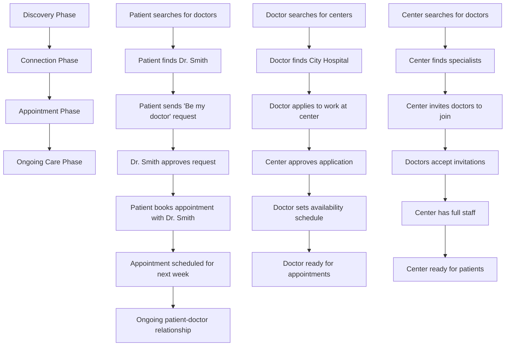
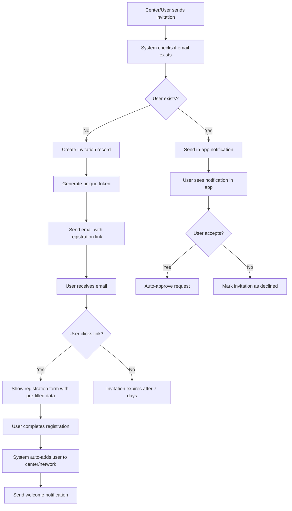

# Complete Healthcare Discovery & Matching System

## **Discovery System vs Appointment System**

### **Key Differences:**

| Aspect | Discovery System | Appointment System |
|--------|------------------|-------------------|
| **Purpose** | Find & connect people | Schedule medical visits |
| **When used** | Before appointments | For specific time slots |
| **Duration** | Long-term relationships | Specific time periods |
| **Data** | Professional profiles | Calendar & scheduling |
| **Actions** | Search, request, approve | Book, confirm, cancel |
| **Users** | All user types | Patients + Healthcare providers |

### **How They Work Together:**

#### **The Complete Healthcare Workflow:**


#### **Real-World Example:**

**Step 1: Discovery (New System)**
- Patient searches: "Cardiologist near me"
- Finds Dr. Johnson at City Hospital
- Sends request: "I'd like you to be my cardiologist"

**Step 2: Connection (New System)**
- Dr. Johnson approves the request
- Patient is now "connected" to Dr. Johnson
- They can see each other in their networks

**Step 3: Appointment (Existing System)**
- Patient books appointment: "Next Tuesday 2:30 PM"
- Dr. Johnson confirms
- System sends reminders

**Step 4: Ongoing Care (Both Systems)**
- Patient can book more appointments easily
- Dr. Johnson can see patient's history
- They maintain professional relationship

#### **Email Invitation Example:**

**Center Invitation Workflow:**
- City Hospital needs a cardiologist
- Hospital admin searches for cardiologists but finds none available
- Admin sends email invitation to "dr.smith@example.com"
- Dr. Smith receives email with registration link
- Dr. Smith clicks link, registers, and is automatically added to City Hospital staff
- Dr. Smith can now be discovered by patients and book appointments

**Patient Invitation Workflow:**
- Dr. Johnson wants to invite a patient to use the platform
- Dr. Johnson sends email invitation to "patient@example.com"
- Patient receives email with registration link
- Patient clicks link, registers as patient
- Patient is automatically connected to Dr. Johnson
- Patient can now book appointments with Dr. Johnson

### **Why Both Are Needed:**

#### **Without Discovery System:**
- Patients can't find doctors (current problem!)
- Doctors can't find centers to work at
- Centers can't recruit staff
- No professional networking
- **Result:** Appointment system is useless because there are no doctors!

#### **Without Appointment System:**
- People can find each other but can't schedule meetings
- No way to book specific time slots
- No appointment management
- **Result:** Discovery is useless because you can't actually meet!

### **Current State Analysis:**

#### **✅ What We Have:**
- **Appointment System:** Complete and functional
- **User Registration:** All user types can register
- **Staff Management:** Centers can add staff (if they have UUIDs)

#### **❌ What We're Missing:**
- **Discovery System:** No way to find people
- **Connection System:** No way to establish relationships
- **Professional Profiles:** No detailed user information

### **The Problem This Solves:**

#### **Current Issue:**
```
Patient wants appointment → Searches for doctor → Can't find any → System fails
```

#### **With Discovery System:**
```
Patient searches → Finds Dr. Smith → Sends request → Dr. Smith approves → 
Patient books appointment → Appointment scheduled successfully
```

## **Complete Workflow Design**

### **Core Discovery Workflow:**

#### **1. Patient Discovery:**
- **Can discover:** Centers by type/location, doctors by specialty, practitioners
- **Can send requests:** "Request to be my doctor", "Join this center", "Refer me to specialist"
- **Limitations:** Cannot see other patients' data, limited access to private doctor info

#### **2. Doctor Discovery:**
- **Can discover:** Centers to join, other doctors for collaboration, patients (basic info)
- **Can send requests:** "Apply to work at center", "Collaborate on case", "Invite patient"
- **Limitations:** Cannot access patient medical records without consent

#### **3. Center Discovery:**
- **Can discover:** Doctors by specialty, practitioners, patients (demographics)
- **Can send requests:** "Invite to join team", "Apply for partnership", "Invite patient"
- **Limitations:** Cannot access sensitive patient data without authorization

#### **4. Practitioner Discovery:**
- **Can discover:** Centers to join, doctors to work with, patients (basic info)
- **Can send requests:** "Apply for position", "Request collaboration", "Join team"
- **Limitations:** Similar to doctors but with more restricted access

## **Backend Analysis**

### **✅ Backend Already Has (MASSIVE REUSE OPPORTUNITIES!):**

#### **1. Complete User Profile System:**
```typescript
// ✅ Already Available - User profiles with professional info
GET /api/users/profile - Get current user profile
POST /api/users/profile - Create/update profile
GET /api/users/:id - Get user by ID (with role restrictions)

// ✅ Profile Entity Already Has:
- firstName, lastName, displayName
- phone, avatar, dateOfBirth, gender
- address, specialization, licenseNumber, experience
```

#### **2. Center Search & Filtering System:**
```typescript
// ✅ Already Available - Center discovery by type
GET /api/centers/types - Get all center types
GET /api/centers/types/:type - Get centers by type
GET /api/centers/eye-clinics - Get eye clinics
GET /api/centers/maternity - Get maternity centers
GET /api/centers/virology - Get virology centers
GET /api/centers/psychiatric - Get psychiatric centers
GET /api/centers/care-homes - Get care homes
GET /api/centers/hospice - Get hospice centers
GET /api/centers/funeral - Get funeral services
GET /api/centers/hospital - Get hospitals
```

#### **3. Location Services:**
```typescript
// ✅ Already Available - Location-based discovery
POST /api/location/validate-coordinates - Validate GPS coordinates
POST /api/location/calculate-distance - Calculate distance between points
POST /api/location/geocode - Convert address to coordinates
POST /api/location/reverse-geocode - Convert coordinates to address
GET /api/location/geofences - Get geofence zones
```

#### **4. Request/Application System:**
```typescript
// ✅ Already Available - Medical record sharing requests
POST /api/medical-records/sharing/requests - Create share request
GET /api/medical-records/sharing/requests/center/:centerId - Get center requests
GET /api/medical-records/sharing/requests/patient/:patientId - Get patient requests
PATCH /api/medical-records/sharing/requests/:id/respond - Respond to request
DELETE /api/medical-records/sharing/requests/:id/cancel - Cancel request

// ✅ Already Available - Referral system
POST /api/referrals - Create referral
GET /api/referrals - Get referrals with filters
PATCH /api/referrals/:id - Update referral
GET /api/referrals/analytics/:centerId - Get referral analytics
```

#### **5. Staff Management:**
```typescript
// ✅ Already Available - Center staff management
POST /api/centers/:id/staff - Add staff to center
GET /api/centers/:id/staff - Get center staff
DELETE /api/centers/:id/staff/:staffId - Remove staff
```

#### **6. Complete Notification System:**
```typescript
// ✅ Already Available - Complete notification system
GET /api/notifications - Get user notifications
POST /api/notifications - Create notification
PUT /api/notifications/:id/read - Mark as read
GET /api/notifications/preferences - Get preferences
PUT /api/notifications/preferences - Update preferences
WebSocket: /ws/notifications - Real-time notifications
```

#### **7. Other Existing Systems:**
- User registration system (all user types)
- Appointment booking system
- Role-based access control
- JWT authentication
- Audit logging system
- File upload/management
- Real-time WebSocket gateway

### **❌ Backend Needs to Add (MINIMAL ADDITIONS!):**

#### **1. Email Invitation System (NEW - 2-3 days):**
```typescript
// Create new invitations module
src/invitations/
├── invitations.controller.ts
├── invitations.service.ts
├── entities/invitation.entity.ts
├── dto/create-invitation.dto.ts
├── dto/accept-invitation.dto.ts
└── invitations.module.ts

// Email invitation endpoints
POST /api/centers/{id}/staff/invite
Body: {
  email: string,
  role: string,
  message?: string,
  invitationType: 'staff_invitation'
}

POST /api/requests/invite
Body: {
  email: string,
  requestType: 'doctor_invitation' | 'patient_invitation' | 'collaboration_invitation',
  message?: string,
  metadata?: Record<string, unknown>
}

GET /api/invitations/pending?email=doctor@example.com
Response: {
  invitations: Invitation[],
  total: number
}

POST /api/invitations/{token}/accept
Body: {
  name: string,
  password: string,
  phone?: string,
  profileData?: Record<string, unknown>
}

POST /api/invitations/{token}/decline
Body: {
  reason?: string
}
```

#### **2. Enhanced Search APIs (Extend Existing):**
```typescript
// Add to existing users controller
GET /api/users/search?type=doctor&specialty=cardiology&location=city&page=1&limit=20
Response: {
  users: UserProfile[],
  total: number,
  page: number,
  hasMore: boolean
}

// Add to existing centers controller
GET /api/centers/search?type=hospital&location=city&services=emergency&radius=50
Response: {
  centers: CenterProfile[],
  total: number,
  page: number,
  hasMore: boolean
}

// Add to existing users controller
GET /api/users/{id}/public-profile
Response: {
  id: string,
  name: string,
  specialty?: string,
  location?: string,
  rating?: number,
  availability?: string,
  // Only public information
}
```

#### **3. General Request System (Extend Existing):**
```typescript
// Create new requests controller (reuse medical-record-sharing pattern)
POST /api/requests
Body: {
  recipientId: string,
  requestType: 'connection' | 'job_application' | 'collaboration' | 'patient_request' | 'staff_invitation',
  message: string,
  metadata?: Record<string, unknown>
}

// Reuse existing pattern from medical-record-sharing
GET /api/requests/received?status=pending&type=job_application&page=1
GET /api/requests/sent?status=approved&page=1
PATCH /api/requests/{id}/respond
Body: {
  action: 'approve' | 'reject',
  message?: string
}
```

#### **4. Enhanced User Profiles (Extend Existing):**
```typescript
// Add to existing users controller
PATCH /api/users/profile/professional
Body: {
  specialty: string,
  qualifications: string[],
  experienceYears: number,
  location: {
    city: string,
    state: string,
    country: string,
    coordinates?: { lat: number, lng: number }
  },
  availability: {
    schedule: Record<string, { start: string, end: string }>,
    timezone: string
  }
}

// Add to existing users controller
PATCH /api/users/profile/privacy
Body: {
  profileVisibility: 'public' | 'private' | 'professional_only',
  dataSharing: {
    allowPatientRequests: boolean,
    allowCenterInvitations: boolean,
    allowDoctorCollaboration: boolean
  },
  contactPreferences: {
    email: boolean,
    phone: boolean,
    inApp: boolean
  }
}
```

#### **5. Notification System (Already Implemented!):**
```typescript
// ✅ Already Available - Real-time notifications
WebSocket: /ws/notifications
Events: {
  'notification': { id, type, title, message, userId, createdAt },
  'urgent_alert': { type, title, message, severity, actionRequired },
  'system_notification': { type, title, message, priority, targetAudience }
}

// ✅ Already Available - Notification management
GET /api/notifications - Get user notifications
POST /api/notifications - Create notification
PUT /api/notifications/:id/read - Mark as read
PUT /api/notifications/mark-all-read - Mark all as read
DELETE /api/notifications/:id - Delete notification
GET /api/notifications/preferences - Get user preferences
PUT /api/notifications/preferences - Update preferences

// ✅ Already Available - Delivery methods
- In-app notifications
- Email notifications  
- SMS notifications
- Push notifications
- Real-time WebSocket
```

#### **5. Email Invitation System (NEW - NEEDS TO BE ADDED!):**
```typescript
// ❌ MISSING - Email invitation system for non-registered users
POST /api/centers/{id}/staff/invite - Send email invitation to non-registered user
POST /api/requests/invite - Send general invitation (doctor, patient, etc.)
GET /api/invitations/pending - Get pending invitations for email
POST /api/invitations/{token}/accept - Accept invitation and register
POST /api/invitations/{token}/decline - Decline invitation

// Email invitation workflow:
// 1. Center sends invitation to doctor@example.com
// 2. System creates invitation record with unique token
// 3. Email sent with registration link containing token
// 4. User clicks link, registers with token
// 5. System auto-adds user to center staff
// 6. User receives welcome notification
```

## **Frontend Implementation**

### **1. Discovery/Search Interface:**

#### **Search Page Components:**
```typescript
// Main search page
<SearchPage>
  <SearchFilters>
    <UserTypeFilter options={['doctor', 'center', 'practitioner']} />
    <SpecialtyFilter options={specialties} />
    <LocationFilter radius={50} />
    <AvailabilityFilter />
    <ExperienceFilter />
  </SearchFilters>
  
  <SearchResults>
    {results.map(user => (
      <UserCard
        key={user.id}
        user={user}
        onRequest={() => openRequestModal(user)}
        onViewProfile={() => viewProfile(user.id)}
      />
    ))}
  </SearchResults>
  
  <Pagination 
    page={currentPage}
    total={totalResults}
    onPageChange={setPage}
  />
</SearchPage>

// User profile card
<UserCard>
  <Avatar src={user.avatar} />
  <UserInfo>
    <Name>{user.name}</Name>
    <Specialty>{user.specialty}</Specialty>
    <Location>{user.location}</Location>
    <Rating value={user.rating} />
  </UserInfo>
  <Actions>
    <Button onClick={onRequest}>Send Request</Button>
    <Button onClick={onViewProfile}>View Profile</Button>
  </Actions>
</UserCard>
```

### **2. Request Management System:**

#### **Request Dashboard:**
```typescript
<RequestDashboard>
  <Tabs>
    <Tab label="Received Requests">
      <RequestList
        requests={receivedRequests}
        onApprove={handleApprove}
        onReject={handleReject}
        onViewDetails={viewRequestDetails}
      />
    </Tab>
    
    <Tab label="Sent Requests">
      <RequestList
        requests={sentRequests}
        onCancel={handleCancel}
        onViewDetails={viewRequestDetails}
      />
    </Tab>
  </Tabs>
</RequestDashboard>

// Request form modal
<RequestModal>
  <RequestForm>
    <RecipientSelector onSelect={setRecipient} />
    <RequestTypeSelector 
      options={availableRequestTypes}
      onChange={setRequestType}
    />
    <MessageInput 
      placeholder="Add a message..."
      value={message}
      onChange={setMessage}
    />
    <MetadataFields 
      type={requestType}
      onChange={setMetadata}
    />
  </RequestForm>
</RequestModal>
```

### **3. Enhanced User Profiles:**

#### **Professional Profile Editor:**
```typescript
<ProfessionalProfileEditor>
  <SpecialtySelector 
    value={specialty}
    onChange={setSpecialty}
    options={medicalSpecialties}
  />
  
  <QualificationsInput
    value={qualifications}
    onChange={setQualifications}
    placeholder="MD, Board Certified, etc."
  />
  
  <ExperienceInput
    years={experienceYears}
    onChange={setExperienceYears}
  />
  
  <LocationSelector
    value={location}
    onChange={setLocation}
    allowCoordinates={true}
  />
  
  <AvailabilityCalendar
    schedule={availability}
    onChange={setAvailability}
    timezone={userTimezone}
  />
</ProfessionalProfileEditor>

// Privacy settings
<PrivacySettings>
  <ProfileVisibilitySelector
    value={profileVisibility}
    onChange={setProfileVisibility}
    options={['public', 'private', 'professional_only']}
  />
  
  <DataSharingControls>
    <Checkbox 
      label="Allow patient requests"
      checked={allowPatientRequests}
      onChange={setAllowPatientRequests}
    />
    <Checkbox 
      label="Allow center invitations"
      checked={allowCenterInvitations}
      onChange={setAllowCenterInvitations}
    />
  </DataSharingControls>
  
  <ContactPreferences>
    <Checkbox label="Email notifications" />
    <Checkbox label="Phone notifications" />
    <Checkbox label="In-app notifications" />
  </ContactPreferences>
</PrivacySettings>
```

### **4. Real-time Notifications:**

#### **Notification Center:**
```typescript
<NotificationCenter>
  <NotificationList>
    {notifications.map(notification => (
      <NotificationItem
        key={notification.id}
        type={notification.type}
        message={notification.message}
        timestamp={notification.timestamp}
        onAction={handleNotificationAction}
        onDismiss={dismissNotification}
      />
    ))}
  </NotificationList>
</NotificationCenter>

// WebSocket integration
const useNotifications = () => {
  const [notifications, setNotifications] = useState([]);
  
  useEffect(() => {
    const ws = new WebSocket('ws://api.unlimtedhealth.com/ws/notifications');
    
    ws.onmessage = (event) => {
      const notification = JSON.parse(event.data);
      setNotifications(prev => [notification, ...prev]);
    };
    
    return () => ws.close();
  }, []);
  
  return notifications;
};
```

### **5. Email Invitation System:**

#### **Email Invitation Workflow:**
```typescript
// Email invitation flow for non-registered users
<EmailInvitationFlow>
  <InvitationForm>
    <EmailInput 
      placeholder="doctor@example.com"
      value={email}
      onChange={setEmail}
    />
    <RoleSelector
      options={['doctor', 'nurse', 'practitioner', 'patient']}
      value={role}
      onChange={setRole}
    />
    <MessageInput
      placeholder="Welcome to our healthcare team!"
      value={message}
      onChange={setMessage}
    />
    <SendInvitationButton onClick={sendInvitation} />
  </InvitationForm>
  
  <InvitationStatus>
    <PendingInvitations>
      {pendingInvitations.map(invitation => (
        <InvitationCard
          key={invitation.id}
          email={invitation.email}
          role={invitation.role}
          sentAt={invitation.createdAt}
          status={invitation.status}
          onResend={() => resendInvitation(invitation.id)}
          onCancel={() => cancelInvitation(invitation.id)}
        />
      ))}
    </PendingInvitations>
  </InvitationStatus>
</EmailInvitationFlow>

// Email invitation acceptance page
<InvitationAcceptancePage>
  <InvitationDetails>
    <CenterName>{invitation.centerName}</CenterName>
    <Role>{invitation.role}</Role>
    <Message>{invitation.message}</Message>
  </InvitationDetails>
  
  <RegistrationForm>
    <NameInput value={name} onChange={setName} />
    <PasswordInput value={password} onChange={setPassword} />
    <PhoneInput value={phone} onChange={setPhone} />
    <SpecialtyInput value={specialty} onChange={setSpecialty} />
    <AcceptButton onClick={acceptInvitation} />
    <DeclineButton onClick={declineInvitation} />
  </RegistrationForm>
</InvitationAcceptancePage>
```

#### **Email Templates:**
```typescript
// Email template system
interface EmailTemplate {
  subject: string;
  htmlContent: string;
  textContent: string;
}

const invitationTemplates: Record<string, EmailTemplate> = {
  staff_invitation: {
    subject: "You're invited to join {centerName}",
    htmlContent: `
      <h2>Join {centerName} Healthcare Team</h2>
      <p>You've been invited to join our healthcare team as a {role}.</p>
      <p>Message: {message}</p>
      <a href="{registrationLink}">Accept Invitation & Register</a>
      <p>This invitation expires in 7 days.</p>
    `,
    textContent: "Join {centerName} as {role}. Click: {registrationLink}"
  },
  
  doctor_invitation: {
    subject: "Connect with {senderName} on Unlimited Health",
    htmlContent: `
      <h2>Professional Connection Request</h2>
      <p>{senderName} wants to connect with you on our healthcare platform.</p>
      <p>Message: {message}</p>
      <a href="{registrationLink}">Join & Connect</a>
    `,
    textContent: "Connect with {senderName}. Click: {registrationLink}"
  },
  
  patient_invitation: {
    subject: "Your doctor invites you to join Unlimited Health",
    htmlContent: `
      <h2>Join Your Healthcare Network</h2>
      <p>Dr. {doctorName} invites you to join our patient portal.</p>
      <p>Message: {message}</p>
      <a href="{registrationLink}">Join as Patient</a>
    `,
    textContent: "Join your healthcare network. Click: {registrationLink}"
  }
};
```

## **Email Invitation Integration with Discovery System**

### **How Email Invitations Complete the Discovery System:**

#### **1. Solves the "Empty Platform" Problem:**
- **Problem:** New platform has no users, so discovery system is useless
- **Solution:** Email invitations bring users to the platform
- **Result:** Discovery system becomes immediately useful

#### **2. Enables Network Growth:**
- **Centers can recruit staff** via email invitations
- **Doctors can invite patients** to join their network
- **Patients can invite family members** to use the platform
- **Result:** Organic growth of the healthcare network

#### **3. Seamless User Onboarding:**
- **Email invitation** → **Registration** → **Auto-connection** → **Ready to use**
- **No manual searching** required for invited users
- **Pre-established relationships** from day one

#### **4. Multi-Channel Discovery:**
- **Internal Discovery:** Users already on platform can find each other
- **External Discovery:** Email invitations bring new users to platform
- **Hybrid Discovery:** Existing users can invite others to join specific networks

### **Integration Points:**

#### **1. Center Staff Recruitment:**
```typescript
// Center admin workflow
1. Center admin searches for doctors (discovery system)
2. If no suitable doctors found, send email invitations
3. Invited doctors register and auto-join center
4. New doctors become discoverable by patients
5. Complete healthcare ecosystem established
```

#### **2. Patient Network Building:**
```typescript
// Doctor workflow
1. Doctor treats patient in person
2. Doctor invites patient to join platform via email
3. Patient registers and auto-connects to doctor
4. Patient can now book future appointments online
5. Doctor's patient network grows organically
```

#### **3. Professional Collaboration:**
```typescript
// Doctor-to-doctor workflow
1. Doctor needs specialist consultation
2. Doctor searches for specialists (discovery system)
3. If no suitable specialist found, send email invitation
4. Specialist registers and joins platform
5. Doctors can now collaborate and refer patients
```

## **Complete Email Invitation Workflow**

### **Workflow Diagram:**


### **Backend Implementation:**

#### **1. Invitation Entity:**
```typescript
// File: src/invitations/entities/invitation.entity.ts
@Entity('invitations')
export class Invitation {
  @PrimaryGeneratedColumn('uuid')
  id: string;

  @Column()
  email: string;

  @Column()
  invitationType: string; // 'staff_invitation', 'doctor_invitation', 'patient_invitation'

  @Column()
  role?: string; // For staff invitations

  @Column({ type: 'text', nullable: true })
  message: string;

  @Column({ unique: true })
  token: string;

  @Column({ default: 'pending' })
  status: 'pending' | 'accepted' | 'declined' | 'expired';

  @Column({ nullable: true })
  centerId: string;

  @Column({ nullable: true })
  senderId: string;

  @Column({ type: 'jsonb', nullable: true })
  metadata: Record<string, unknown>;

  @Column({ name: 'expires_at' })
  expiresAt: Date;

  @Column({ name: 'accepted_at', nullable: true })
  acceptedAt: Date;

  @Column({ name: 'declined_at', nullable: true })
  declinedAt: Date;

  @CreateDateColumn({ name: 'created_at' })
  createdAt: Date;

  @UpdateDateColumn({ name: 'updated_at' })
  updatedAt: Date;

  // Relations
  @ManyToOne(() => Center)
  @JoinColumn({ name: 'center_id' })
  center: Center;

  @ManyToOne(() => User)
  @JoinColumn({ name: 'sender_id' })
  sender: User;
}
```

#### **2. Invitation Service:**
```typescript
// File: src/invitations/invitations.service.ts
@Injectable()
export class InvitationsService {
  constructor(
    @InjectRepository(Invitation)
    private readonly invitationRepository: Repository<Invitation>,
    private readonly usersService: UsersService,
    private readonly emailService: EmailNotificationService,
    private readonly notificationsService: NotificationsService,
  ) {}

  async createInvitation(createInvitationDto: CreateInvitationDto): Promise<Invitation> {
    // Check if user already exists
    const existingUser = await this.usersService.findByEmail(createInvitationDto.email);
    if (existingUser) {
      // Send in-app notification instead
      await this.notificationsService.createNotification({
        userId: existingUser.id,
        type: 'invitation_received',
        title: 'New Invitation',
        message: `You have a new ${createInvitationDto.invitationType} invitation`,
        data: { invitationData: createInvitationDto }
      });
      throw new ConflictException('User already exists. Notification sent instead.');
    }

    // Generate unique token
    const token = this.generateInvitationToken();
    
    // Create invitation record
    const invitation = this.invitationRepository.create({
      ...createInvitationDto,
      token,
      expiresAt: new Date(Date.now() + 7 * 24 * 60 * 60 * 1000), // 7 days
    });

    const savedInvitation = await this.invitationRepository.save(invitation);

    // Send email invitation
    await this.sendInvitationEmail(savedInvitation);

    return savedInvitation;
  }

  async acceptInvitation(token: string, acceptDto: AcceptInvitationDto): Promise<User> {
    const invitation = await this.findInvitationByToken(token);
    
    if (invitation.status !== 'pending') {
      throw new BadRequestException('Invitation already processed');
    }

    if (invitation.expiresAt < new Date()) {
      throw new BadRequestException('Invitation has expired');
    }

    // Create user account
    const user = await this.usersService.createUser({
      email: invitation.email,
      password: acceptDto.password,
      name: acceptDto.name,
      roles: [invitation.role || 'patient'],
      phone: acceptDto.phone,
    });

    // Update invitation status
    invitation.status = 'accepted';
    invitation.acceptedAt = new Date();
    await this.invitationRepository.save(invitation);

    // Auto-add to center if staff invitation
    if (invitation.invitationType === 'staff_invitation' && invitation.centerId) {
      await this.addUserToCenter(user.id, invitation.centerId, invitation.role);
    }

    // Send welcome notification
    await this.notificationsService.createNotification({
      userId: user.id,
      type: 'welcome',
      title: 'Welcome to Unlimited Health!',
      message: 'Your account has been created successfully.',
    });

    return user;
  }

  private async sendInvitationEmail(invitation: Invitation): Promise<void> {
    const registrationLink = `${process.env.FRONTEND_URL}/invitation/accept?token=${invitation.token}`;
    
    const template = this.getEmailTemplate(invitation.invitationType);
    const subject = template.subject.replace('{centerName}', invitation.center?.name || 'Our Platform');
    const htmlContent = template.htmlContent
      .replace('{centerName}', invitation.center?.name || 'Our Platform')
      .replace('{role}', invitation.role || 'member')
      .replace('{message}', invitation.message || '')
      .replace('{registrationLink}', registrationLink);

    await this.emailService.sendEmail({
      to: invitation.email,
      subject,
      html: htmlContent,
    });
  }

  private generateInvitationToken(): string {
    return crypto.randomBytes(32).toString('hex');
  }
}
```

#### **3. Database Schema Addition:**
```sql
-- File: src/migrations/[timestamp]-AddInvitationsTable.sql
CREATE TABLE invitations (
  id UUID PRIMARY KEY DEFAULT gen_random_uuid(),
  email VARCHAR(255) NOT NULL,
  invitation_type VARCHAR(50) NOT NULL,
  role VARCHAR(50),
  message TEXT,
  token VARCHAR(255) UNIQUE NOT NULL,
  status VARCHAR(20) DEFAULT 'pending' CHECK (status IN (
    'pending', 'accepted', 'declined', 'expired'
  )),
  center_id UUID REFERENCES centers(id) ON DELETE CASCADE,
  sender_id UUID REFERENCES users(id) ON DELETE CASCADE,
  metadata JSONB,
  expires_at TIMESTAMP WITH TIME ZONE NOT NULL,
  accepted_at TIMESTAMP WITH TIME ZONE,
  declined_at TIMESTAMP WITH TIME ZONE,
  created_at TIMESTAMP WITH TIME ZONE DEFAULT NOW(),
  updated_at TIMESTAMP WITH TIME ZONE DEFAULT NOW()
);

-- Indexes for performance
CREATE INDEX idx_invitations_email ON invitations(email);
CREATE INDEX idx_invitations_token ON invitations(token);
CREATE INDEX idx_invitations_status ON invitations(status);
CREATE INDEX idx_invitations_center ON invitations(center_id);
CREATE INDEX idx_invitations_expires ON invitations(expires_at);
```

## **User Type Limitations & Permissions**

### **Patient Discovery Limitations:**
- ✅ **Can see:** Doctor names, specialties, locations, ratings, availability
- ❌ **Cannot see:** Personal contact info, detailed medical records, internal notes
- ✅ **Can send:** Connection requests, appointment requests, referral requests
- ❌ **Cannot:** See other patients' information, access private doctor data

### **Doctor Discovery Limitations:**
- ✅ **Can see:** Other doctors' professional info, center details, patient basic demographics
- ❌ **Cannot see:** Patient medical records (without permission), other doctors' personal info
- ✅ **Can send:** Collaboration requests, center applications, patient invitations
- ❌ **Cannot:** Access private patient data without consent

### **Center Discovery Limitations:**
- ✅ **Can see:** Doctor professional profiles, practitioner info, patient basic demographics
- ❌ **Cannot see:** Patient medical records, private user information
- ✅ **Can send:** Job invitations, patient invitations, staff applications
- ❌ **Cannot:** Access sensitive patient data without proper authorization

## **Database Schema Additions**

### **User Requests Table:**
```sql
CREATE TABLE user_requests (
  id UUID PRIMARY KEY DEFAULT gen_random_uuid(),
  sender_id UUID NOT NULL REFERENCES users(id) ON DELETE CASCADE,
  recipient_id UUID NOT NULL REFERENCES users(id) ON DELETE CASCADE,
  request_type VARCHAR(50) NOT NULL CHECK (request_type IN (
    'connection', 'job_application', 'collaboration', 
    'patient_request', 'staff_invitation', 'referral'
  )),
  status VARCHAR(20) NOT NULL DEFAULT 'pending' CHECK (status IN (
    'pending', 'approved', 'rejected', 'cancelled'
  )),
  message TEXT,
  metadata JSONB,
  created_at TIMESTAMP WITH TIME ZONE DEFAULT NOW(),
  responded_at TIMESTAMP WITH TIME ZONE,
  response_message TEXT,
  created_by UUID REFERENCES users(id),
  updated_at TIMESTAMP WITH TIME ZONE DEFAULT NOW()
);

-- Indexes for performance
CREATE INDEX idx_user_requests_sender ON user_requests(sender_id);
CREATE INDEX idx_user_requests_recipient ON user_requests(recipient_id);
CREATE INDEX idx_user_requests_status ON user_requests(status);
CREATE INDEX idx_user_requests_type ON user_requests(request_type);
```

### **Enhanced User Profiles:**
```sql
CREATE TABLE user_professional_profiles (
  id UUID PRIMARY KEY DEFAULT gen_random_uuid(),
  user_id UUID NOT NULL REFERENCES users(id) ON DELETE CASCADE,
  specialty VARCHAR(100),
  qualifications TEXT[],
  experience_years INTEGER DEFAULT 0,
  location JSONB, -- {city, state, country, coordinates}
  availability JSONB, -- {schedule, timezone}
  public_profile BOOLEAN DEFAULT true,
  contact_preferences JSONB, -- {email, phone, inApp}
  profile_visibility VARCHAR(20) DEFAULT 'public' CHECK (profile_visibility IN (
    'public', 'private', 'professional_only'
  )),
  data_sharing JSONB, -- {allowPatientRequests, allowCenterInvitations, etc.}
  created_at TIMESTAMP WITH TIME ZONE DEFAULT NOW(),
  updated_at TIMESTAMP WITH TIME ZONE DEFAULT NOW(),
  UNIQUE(user_id)
);

-- Indexes
CREATE INDEX idx_professional_profiles_specialty ON user_professional_profiles(specialty);
CREATE INDEX idx_professional_profiles_location ON user_professional_profiles USING GIN(location);
CREATE INDEX idx_professional_profiles_public ON user_professional_profiles(public_profile);
```

### **Notifications Table:**
```sql
CREATE TABLE notifications (
  id UUID PRIMARY KEY DEFAULT gen_random_uuid(),
  user_id UUID NOT NULL REFERENCES users(id) ON DELETE CASCADE,
  type VARCHAR(50) NOT NULL,
  title VARCHAR(255) NOT NULL,
  message TEXT NOT NULL,
  data JSONB,
  read_at TIMESTAMP WITH TIME ZONE,
  created_at TIMESTAMP WITH TIME ZONE DEFAULT NOW(),
  expires_at TIMESTAMP WITH TIME ZONE
);

-- Indexes
CREATE INDEX idx_notifications_user ON notifications(user_id);
CREATE INDEX idx_notifications_unread ON notifications(user_id, read_at) WHERE read_at IS NULL;
CREATE INDEX idx_notifications_type ON notifications(type);
```

## **🚀 BACKEND DEVELOPER GUIDANCE - REUSE EXISTING FEATURES!**

### **📋 What You Can Reuse (Don't Rebuild!):**

#### **1. User Profile System (Already Complete!)**
```typescript
// ✅ REUSE: src/users/entities/profile.entity.ts
// ✅ REUSE: src/users/users.controller.ts
// ✅ REUSE: src/users/users.service.ts

// Just add these fields to existing Profile entity:
- specialty (already exists!)
- licenseNumber (already exists!)
- experience (already exists!)
- Add: qualifications, location, availability, privacy settings
```

#### **2. Center Search System (Already Complete!)**
```typescript
// ✅ REUSE: src/centers/centers.controller.ts
// ✅ REUSE: src/centers/centers.service.ts
// ✅ REUSE: All center type endpoints (eye-clinics, maternity, etc.)

// Just add these endpoints to existing controller:
GET /api/centers/search?location=city&radius=50
GET /api/centers/nearby?lat=40.7128&lng=-74.0060&radius=25
```

#### **3. Request System (Already Complete!)**
```typescript
// ✅ REUSE: src/medical-records/medical-record-sharing.controller.ts
// ✅ REUSE: src/referrals/referrals.controller.ts
// ✅ REUSE: Request/response patterns, DTOs, entities

// Just create new requests controller using same patterns:
src/requests/requests.controller.ts
src/requests/requests.service.ts
src/requests/entities/request.entity.ts
```

#### **4. Notification System (Already Complete!)**
```typescript
// ✅ REUSE: src/notifications/ (entire module!)
// ✅ REUSE: WebSocket gateway, email service, preferences

// Just integrate with existing notification system
```

#### **5. Location Services (Already Complete!)**
```typescript
// ✅ REUSE: src/location/ (entire module!)
// ✅ REUSE: Geocoding, geofencing, distance calculation

// Just integrate with existing location services
```

### **📝 What You Need to Build (Minimal!):**

#### **1. Enhanced Search APIs (1-2 days)**
```typescript
// Add to existing UsersController:
@Get('search')
async searchUsers(@Query() filters: SearchUsersDto) {
  return this.usersService.searchUsers(filters);
}

@Get(':id/public-profile')
async getPublicProfile(@Param('id') id: string) {
  return this.usersService.getPublicProfile(id);
}

// Add to existing CentersController:
@Get('search')
async searchCenters(@Query() filters: SearchCentersDto) {
  return this.centersService.searchCenters(filters);
}
```

#### **2. General Request System (2-3 days)**
```typescript
// Copy medical-record-sharing pattern:
src/requests/
├── requests.controller.ts (copy from medical-record-sharing)
├── requests.service.ts (copy from medical-record-sharing)
├── entities/request.entity.ts (copy from medical-record-share-request)
└── dto/create-request.dto.ts (copy from create-share-request)
```

#### **3. Enhanced Profile Fields (1 day)**
```typescript
// Add to existing Profile entity:
@Column({ type: 'jsonb', nullable: true })
qualifications: string[];

@Column({ type: 'jsonb', nullable: true })
location: { city: string; state: string; coordinates?: { lat: number; lng: number } };

@Column({ type: 'jsonb', nullable: true })
availability: { schedule: Record<string, { start: string; end: string }>; timezone: string };

@Column({ type: 'jsonb', nullable: true })
privacySettings: { profileVisibility: string; dataSharing: Record<string, boolean> };
```

## **Implementation Priority (REVISED - MUCH FASTER!)**

### **Phase 1: Backend Enhancements (1-2 weeks)**
**Why First:** Extend existing systems instead of building new ones
1. ✅ **Add search endpoints** to existing controllers (1-2 days)
2. ✅ **Create requests module** using existing patterns (2-3 days)
3. ✅ **Create email invitation system** for non-registered users (2-3 days)
4. ✅ **Enhance profile entity** with new fields (1 day)
5. ✅ **Integrate with existing notification system** (1 day)
6. ✅ **Add privacy controls** to existing profile system (1 day)

### **Phase 2: Frontend Discovery Interface (2-3 weeks)**
**Why Second:** Build on existing notification and profile systems
1. ✅ **Reuse existing notification center** (already built!)
2. ✅ **Extend existing profile components** (already built!)
3. ✅ **Build search components** using existing APIs
4. ✅ **Create request management** using existing patterns
5. ✅ **Integrate with existing appointment system** (already built!)

### **Phase 3: Integration & Testing (1 week)**
**Why Third:** Connect everything together
1. ✅ **Test all user workflows**
2. ✅ **Security and privacy testing**
3. ✅ **Performance optimization**

## **🎯 MASSIVE TIME SAVINGS!**

### **What You DON'T Need to Build:**
- ❌ ~~User profile system~~ ✅ **Already exists!**
- ❌ ~~Center search/filtering~~ ✅ **Already exists!**
- ❌ ~~Location services~~ ✅ **Already exists!**
- ❌ ~~Request/application system~~ ✅ **Already exists!**
- ❌ ~~Notification system~~ ✅ **Already exists!**
- ❌ ~~Staff management~~ ✅ **Already exists!**

### **What You DO Need to Build:**
- ✅ **Enhanced search APIs** (extend existing - 1-2 days)
- ✅ **General request system** (copy existing pattern - 2-3 days)
- ✅ **Email invitation system** (new module - 2-3 days)
- ✅ **Profile field additions** (modify existing entity - 1 day)
- ✅ **Frontend discovery components** (build on existing - 2-3 weeks)

## **📊 Revised Timeline: 3-4 weeks total (vs 8-10 weeks originally!)**

### **Week 1: Backend Enhancements**
- Extend existing user/center APIs for discovery
- Add professional profile fields to existing profile entity
- Create general request system using existing patterns
- Build email invitation system for non-registered users

### **Week 2-4: Frontend Discovery Interface**
- Build search components using existing APIs
- Create request management using existing notification system
- Integrate with existing appointment system

**This is a MASSIVE win - you can build the discovery system in HALF the time by leveraging the robust foundation that's already implemented!**

## **🔧 SPECIFIC BACKEND IMPLEMENTATION STEPS**

### **Step 1: Enhance Profile Entity (1 day)**
```typescript
// File: src/users/entities/profile.entity.ts
// Add these columns to existing Profile entity:

@Column({ type: 'jsonb', nullable: true })
qualifications: string[];

@Column({ type: 'jsonb', nullable: true })
location: { 
  city: string; 
  state: string; 
  country: string;
  coordinates?: { lat: number; lng: number } 
};

@Column({ type: 'jsonb', nullable: true })
availability: { 
  schedule: Record<string, { start: string; end: string }>; 
  timezone: string 
};

@Column({ type: 'jsonb', nullable: true })
privacySettings: { 
  profileVisibility: 'public' | 'private' | 'professional_only';
  dataSharing: Record<string, boolean>;
  contactPreferences: Record<string, boolean>;
};
```

### **Step 2: Add Search Endpoints (1-2 days)**
```typescript
// File: src/users/users.controller.ts
// Add these endpoints to existing controller:

@Get('search')
@ApiOperation({ summary: 'Search users by criteria' })
async searchUsers(@Query() filters: SearchUsersDto) {
  return this.usersService.searchUsers(filters);
}

@Get(':id/public-profile')
@ApiOperation({ summary: 'Get public user profile' })
async getPublicProfile(@Param('id') id: string) {
  return this.usersService.getPublicProfile(id);
}

// File: src/centers/centers.controller.ts
// Add these endpoints to existing controller:

@Get('search')
@ApiOperation({ summary: 'Search centers by criteria' })
async searchCenters(@Query() filters: SearchCentersDto) {
  return this.centersService.searchCenters(filters);
}

@Get('nearby')
@ApiOperation({ summary: 'Find nearby centers' })
async getNearbyCenters(@Query() location: NearbyCentersDto) {
  return this.centersService.getNearbyCenters(location);
}
```

### **Step 3: Create Request System (2-3 days)**
```typescript
// Copy entire medical-record-sharing module structure:
// src/requests/
// ├── requests.controller.ts (copy from medical-record-sharing.controller.ts)
// ├── requests.service.ts (copy from medical-record-sharing.service.ts)
// ├── entities/request.entity.ts (copy from medical-record-share-request.entity.ts)
// ├── dto/create-request.dto.ts (copy from create-share-request.dto.ts)
// ├── dto/respond-request.dto.ts (copy from respond-share-request.dto.ts)
// └── requests.module.ts (copy from medical-record-sharing.module.ts)

// Just change the entity names and request types:
// - MedicalRecordShareRequest → UserRequest
// - 'share_request' → 'connection', 'job_application', etc.
```

### **Step 4: Integrate Notifications (1 day)**
```typescript
// File: src/requests/requests.service.ts
// Add notification integration:

async createRequest(createRequestDto: CreateRequestDto) {
  const request = await this.requestRepository.save(createRequestDto);
  
  // ✅ REUSE existing notification system
  await this.notificationsService.createNotification({
    userId: createRequestDto.recipientId,
    type: 'request_received',
    title: 'New Connection Request',
    message: `You have a new ${createRequestDto.requestType} request`,
    data: { requestId: request.id, senderId: createRequestDto.senderId }
  });
  
  return request;
}
```

### **Step 5: Add Database Migration (1 day)**
```sql
-- File: src/migrations/[timestamp]-AddDiscoveryFields.sql
ALTER TABLE profiles ADD COLUMN qualifications JSONB;
ALTER TABLE profiles ADD COLUMN location JSONB;
ALTER TABLE profiles ADD COLUMN availability JSONB;
ALTER TABLE profiles ADD COLUMN privacy_settings JSONB;

-- Create requests table (copy from medical_record_share_requests)
CREATE TABLE user_requests (
  id UUID PRIMARY KEY DEFAULT gen_random_uuid(),
  sender_id UUID NOT NULL REFERENCES users(id) ON DELETE CASCADE,
  recipient_id UUID NOT NULL REFERENCES users(id) ON DELETE CASCADE,
  request_type VARCHAR(50) NOT NULL,
  status VARCHAR(20) NOT NULL DEFAULT 'pending',
  message TEXT,
  metadata JSONB,
  created_at TIMESTAMP WITH TIME ZONE DEFAULT NOW(),
  responded_at TIMESTAMP WITH TIME ZONE,
  response_message TEXT,
  created_by UUID REFERENCES users(id),
  updated_at TIMESTAMP WITH TIME ZONE DEFAULT NOW()
);
```

## **🎯 FINAL IMPLEMENTATION TIMELINE**

### **Week 1: Backend Foundation (5 days)**
- **Day 1:** Enhance Profile entity with new fields
- **Day 2:** Add search endpoints to existing controllers
- **Day 3-4:** Create request system using existing patterns
- **Day 5:** Create email invitation system for non-registered users

### **Week 2-4: Frontend Discovery Interface**
- **Week 2:** Build search components using existing APIs
- **Week 3:** Create request management using existing notification system
- **Week 4:** Integrate with existing appointment system

**Total Development Time: 3-4 weeks (vs 8-10 weeks originally!)**

## **Security & Privacy Considerations**

### **Data Protection:**
- **HIPAA Compliance:** Patient data protection
- **Role-based Access:** Different permissions for different user types
- **Audit Logging:** Track all requests and approvals
- **Data Encryption:** Sensitive information encryption
- **Consent Management:** Explicit consent for data sharing

### **Privacy Controls:**
- **Profile Visibility:** Public, private, professional-only options
- **Data Sharing Preferences:** Granular control over what data is shared
- **Contact Preferences:** How users want to be contacted
- **Request Filtering:** Users can block certain types of requests

### **Security Measures:**
- **Input Validation:** All user inputs validated
- **Rate Limiting:** Prevent spam requests
- **Authentication:** JWT tokens for all API calls
- **Authorization:** Role-based access control
- **Monitoring:** Real-time security monitoring

## **Conclusion**

This comprehensive healthcare discovery and matching system creates a complete ecosystem where:

1. **All user types can discover each other** with appropriate limitations
2. **Request/application system** enables professional connections
3. **Email invitation system** brings new users to the platform seamlessly
4. **Privacy and security** are maintained throughout
5. **Real-time notifications** keep users informed
6. **Scalable architecture** supports future growth

### **Key Innovations:**

#### **1. Complete Discovery Ecosystem:**
- **Internal Discovery:** Users on platform can find each other
- **External Discovery:** Email invitations bring new users to platform
- **Hybrid Discovery:** Seamless integration between both systems

#### **2. Solves the "Empty Platform" Problem:**
- **No more "chicken and egg" problem** - email invitations bootstrap the user base
- **Immediate value** - discovery system works from day one
- **Organic growth** - users invite others, creating network effects

#### **3. Professional Healthcare Networking:**
- **Centers can recruit staff** via email invitations
- **Doctors can build patient networks** through invitations
- **Patients can invite family members** to join their healthcare network
- **Professional collaboration** enabled through discovery and invitations

#### **4. Seamless User Experience:**
- **Email invitation** → **One-click registration** → **Auto-connection** → **Ready to use**
- **No manual searching** required for invited users
- **Pre-established relationships** from day one
- **Complete integration** with existing appointment system

The system transforms the current healthcare platform from a basic appointment booking system into a comprehensive professional networking and discovery platform while maintaining the highest standards of privacy and security. The email invitation system ensures the platform can grow organically and provides immediate value to all users.


