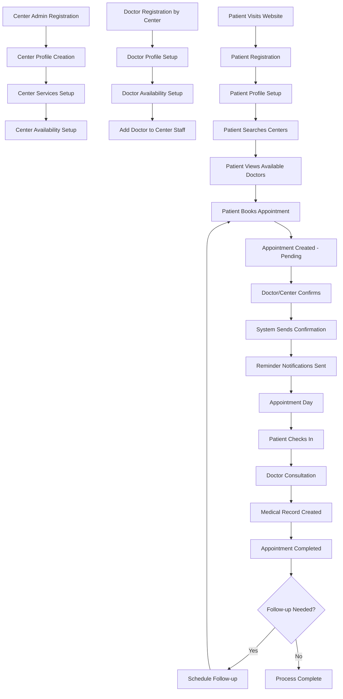
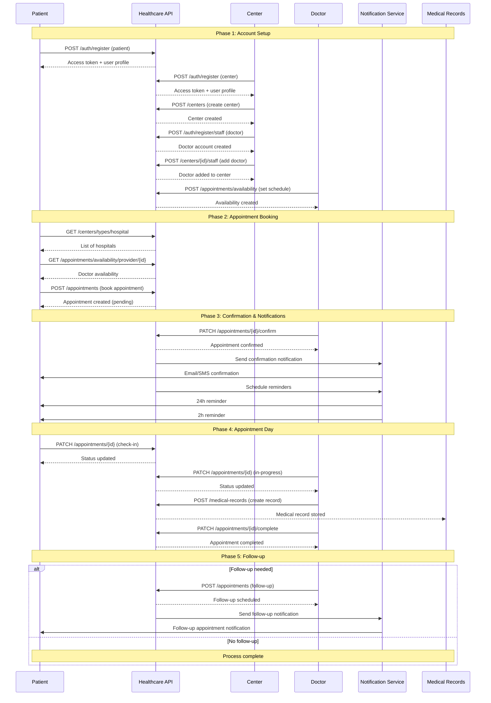
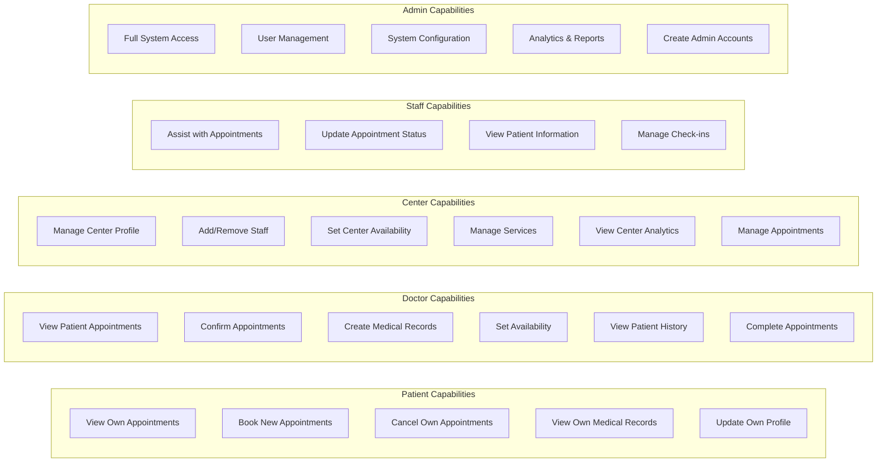
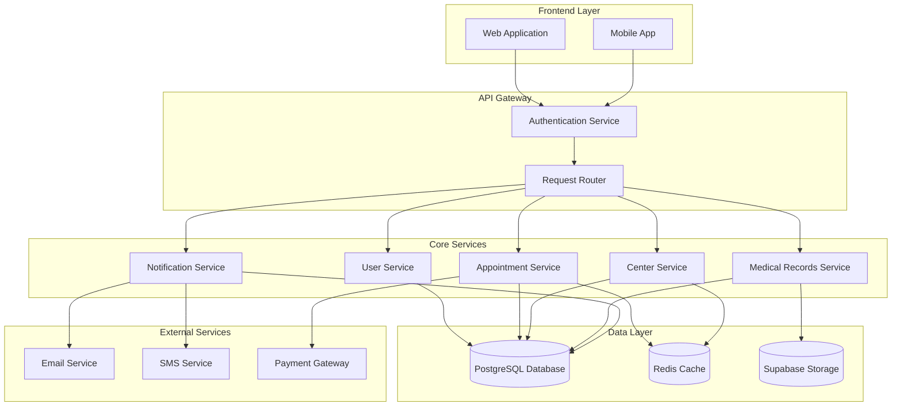
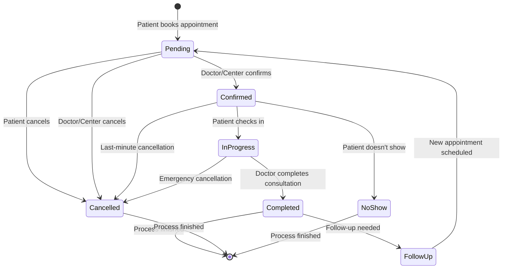
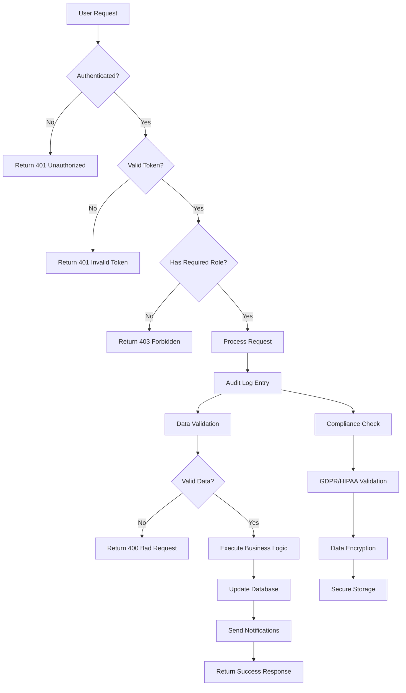

# Healthcare Appointment Booking Workflow Diagram

## Complete User Journey Flow

## Detailed System Interaction Flow

## Role-Based Access Control Flow

## Data Flow Architecture

## Appointment Status Lifecycle

## Security & Compliance Flow

This comprehensive workflow ensures that all stakeholders in the healthcare system can interact seamlessly while maintaining security, compliance, and data integrity throughout the appointment booking and management process.
