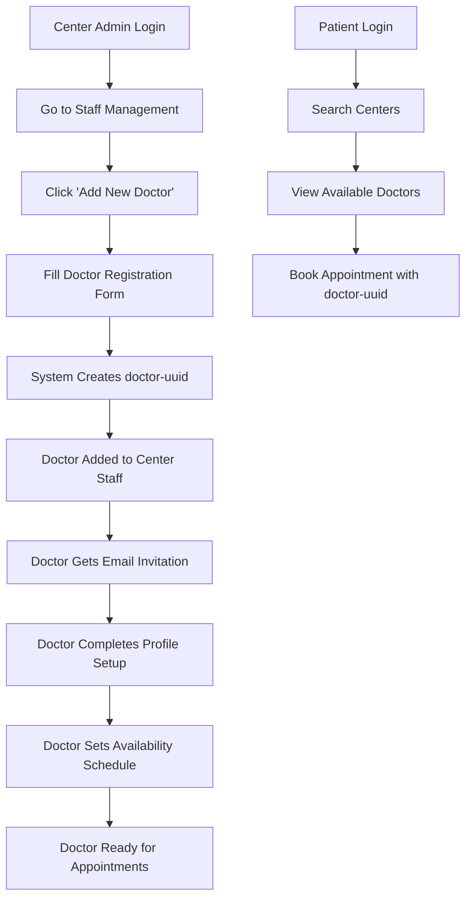

# Frontend Dashboard Analysis - Missing Staff Management Features

## Overview
Analysis of the current frontend dashboards reveals critical missing functionality for staff management that prevents the appointment booking workflow from functioning properly.

## Critical Issues Identified

### 1. Center Dashboard Problems
**Current State:**
- ✅ Has "Staff Management" button in AI Center Assistant section
- ❌ **No actual staff management interface** - no way to add doctors, nurses, or other staff
- ❌ **No doctor registration workflow** for centers to add new doctors
- ❌ **No staff list view** showing current center staff members

**What's Missing:**
- Staff Management Modal (add/edit/remove staff)
- Doctor Registration Form (register new doctors)
- Staff List Component (view all center staff)
- Staff Role Management (assign roles to staff)

### 2. Doctor Dashboard Problems
**Current State:**
- ❌ **No way for doctors to register themselves** with a center
- ❌ **No availability management interface** for doctors to set their schedules
- ❌ **No center association workflow** for doctors to join centers

**What's Missing:**
- Availability Scheduler (set working hours)
- Center Association Form (join centers)
- Profile Setup Wizard (complete doctor profile)
- Schedule Management (manage appointments)

### 3. Patient Dashboard Analysis
**Current State:**
- ✅ Well-designed patient interface
- ✅ Appointment booking functionality
- ❌ **Cannot book appointments** because no doctors are available (missing staff management)

## Root Cause Analysis

### The UUID Dependency Problem
The appointment booking system requires 3 critical UUIDs:
1. **`patient-uuid`** ✅ Available (patient registration works)
2. **`center-uuid`** ✅ Available (center registration works)
3. **`doctor-uuid`** ❌ **MISSING** - No way to create doctors

### Missing Workflow


## Required Frontend Components

### 1. Staff Management Module
**Location:** Center Dashboard → Staff Management
**Components Needed:**
```typescript
interface StaffManagementProps {
  centerId: string;
  onStaffAdded: (staff: StaffMember) => void;
}

// Components:
- StaffManagementModal (add/edit/remove staff)
- DoctorRegistrationForm (register new doctors)
- StaffListComponent (view all center staff)
- StaffRoleManagement (assign roles to staff)
```

### 2. Doctor Onboarding Flow
**Location:** New dedicated pages
**Components Needed:**
```typescript
interface DoctorOnboardingProps {
  centerId: string;
  invitationToken: string;
}

// Pages:
- /center/staff-management - Complete staff management interface
- /center/add-staff - Add new doctors/nurses to center
- /doctor/availability - Set doctor availability schedule
- /doctor/center-association - Join centers as a doctor
```

### 3. Availability Management
**Location:** Doctor Dashboard
**Components Needed:**
```typescript
interface AvailabilityManagementProps {
  doctorId: string;
  centerId: string;
}

// Components:
- AvailabilityScheduler (set working hours)
- TimeSlotManager (manage appointment slots)
- RecurringSchedule (set recurring availability)
- BlockedTimeManager (manage unavailable times)
```

## Backend API Endpoints (Already Available)

The backend already has all necessary endpoints:

```typescript
// Authentication & Registration
POST /api/auth/register/staff  // Register doctor
POST /api/auth/register        // Register center/patient

// Center Management
POST /api/centers              // Create center
POST /api/centers/{id}/staff   // Add staff to center
GET /api/centers/{id}/staff    // Get center staff
DELETE /api/centers/{id}/staff/{staffId} // Remove staff

// Availability Management
POST /api/appointments/availability  // Set doctor availability
GET /api/appointments/availability/provider/{id} // Get availability
PATCH /api/appointments/availability/{id} // Update availability

// Appointment Booking
POST /api/appointments         // Book appointment
GET /api/appointments          // List appointments
```

## Immediate Action Items

### Phase 1: Critical Missing Features
1. **Create Staff Management Interface**
   - Add staff form with role selection
   - Staff list with edit/remove options
   - Doctor invitation system

2. **Create Doctor Onboarding Flow**
   - Doctor registration form
   - Profile completion wizard
   - Center association process

3. **Create Availability Management**
   - Schedule setting interface
   - Time slot management
   - Recurring schedule options

### Phase 2: Enhanced Features
1. **Staff Role Management**
   - Assign specific roles to staff
   - Permission management
   - Department assignments

2. **Advanced Scheduling**
   - Multi-center doctor support
   - Appointment type management
   - Resource allocation

## Implementation Priority

### High Priority (Blocking)
- [ ] Staff Management Modal for Center Dashboard
- [ ] Doctor Registration Form
- [ ] Doctor Availability Scheduler
- [ ] Staff List View

### Medium Priority (Enhancement)
- [ ] Doctor Profile Setup Wizard
- [ ] Advanced Availability Management
- [ ] Staff Role Management
- [ ] Email Invitation System

### Low Priority (Nice to Have)
- [ ] Bulk Staff Import
- [ ] Advanced Analytics
- [ ] Staff Performance Metrics
- [ ] Automated Scheduling

## Expected Outcome

Once these missing components are implemented:

1. **Centers can add doctors** → `doctor-uuid` gets created
2. **Doctors can set availability** → Time slots become available
3. **Patients can book appointments** → Complete workflow functions
4. **System becomes fully operational** → All stakeholders can interact

## Conclusion

The current frontend dashboards are beautifully designed but **functionally incomplete**. The missing staff management functionality is a critical blocker that prevents the entire appointment booking system from working. The frontend developer needs to implement the staff management module immediately to make the healthcare system operational.

**Without these components, the system is essentially a beautiful but non-functional prototype.**
