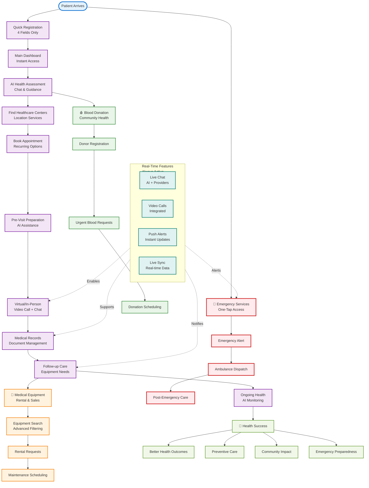

# Simplified Patient Journey Flow

## 🎯 **Core Patient Journey - Simplified View**

This diagram shows the main patient flow in a simplified, easy-to-understand format.



## 🔑 **Key Journey Highlights**

### **1. Quick Start (30 seconds)**
- **4 fields only**: Email, Password, Name, Auto-role
- **Instant access**: Dashboard immediately available
- **Progressive enhancement**: Profile completion optional

### **2. AI as Health Concierge**
- **Persistent assistance**: Available on every screen
- **Context-aware guidance**: Based on current activity
- **Health recommendations**: Personalized care suggestions

### **3. Seamless Service Integration**
- **Appointments → Video Calls**: Natural flow
- **Consultations → Equipment**: Smart suggestions
- **Health → Community**: Blood donation integration

### **4. Emergency Always Accessible**
- **One-tap access**: From any screen
- **Real-time response**: Instant location sharing
- **Post-emergency care**: Seamless transition

### **5. Real-Time Everything**
- **Live updates**: Instant notifications
- **WebSocket support**: Real-time data sync
- **Push alerts**: Critical information delivery

## 📱 **User Experience Flow**

```
Registration (4 fields) → Instant Dashboard → AI Health Chat → 
Center Discovery → Appointment Booking → Pre-Visit Prep → 
Virtual Consultation → Medical Records → Follow-up Care → 
Equipment Needs → Ongoing Health Monitoring
```

## 🎯 **Success Metrics**

- ✅ **Seamless transitions** between health services
- ✅ **AI-guided complexity** with human touch maintained
- ✅ **Real-time updates** keeping users informed
- ✅ **Emergency access** from anywhere in the app
- ✅ **Progressive complexity** growing with user needs
- ✅ **Community health** integration and impact
- ✅ **Mobile-first design** for universal accessibility

---

**This simplified diagram shows how patients flow naturally through the health ecosystem, with AI guidance and real-time features supporting every step of their journey.**
